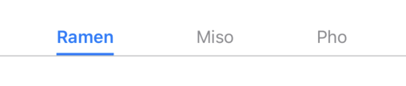
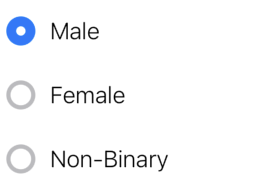

# SwiftUIBuddy

## Description
SwiftUIBuddy is a collection of beautiful, easy-to-use components for your SwiftUI App. It contains custom Buttons, Pickers, Progress Views, Text Fields, and so much more! All of the components are highly customizable and built using 100% SwiftUI.

## Motivation
The framework was designed with simplicity and functionality in mind. It strives to resemble Apple's design style and follow Human Interface Guidelines. For increased stability, SwiftUIBuddy does not depend on any 3rd party libraries or frameworks and is written only using native components provided by SwiftUI.

## How to Install
1) Go to Xcode -> File -> Add Packages
2) Paste https://github.com/Daniel-Berezhnoy/SwiftUIBuddy into the search bar
3) Confirm and install the Package
4) Import **SwiftUIBuddy** in the file(s) where you want to use it

## Notes
The minimum deployment target is iOS 15.0. This project is a work-in-progress, so expect it to grow, and feel free to contribute.

## Screenshots
Here are the screenshots of the components currently included in the package:

### Buttons
&nbsp;&nbsp;&nbsp;&nbsp; StandardButton  

&nbsp;&nbsp;&nbsp;&nbsp; DestructiveButton  

&nbsp;&nbsp;&nbsp;&nbsp; PlusButton  

&nbsp;&nbsp;&nbsp;&nbsp; DismissButton  
&nbsp;&nbsp; 

### Progress Views
&nbsp;&nbsp;&nbsp;&nbsp;&nbsp;&nbsp; CapsuleProgressBar  

&nbsp;&nbsp;&nbsp;&nbsp;&nbsp;&nbsp; LoadingSpinner  
&nbsp;

### Fields
&nbsp;&nbsp;&nbsp; LoginField  
&nbsp;&nbsp; 

&nbsp;&nbsp;&nbsp; DollarTextField  
&nbsp;&nbsp; 

### Pickers
&nbsp;&nbsp;&nbsp; TwitterPicker  
&nbsp;&nbsp;&nbsp; 

&nbsp;&nbsp;&nbsp; RadioPicker  
&nbsp;&nbsp;&nbsp; 

### Alignment Tools
&nbsp;&nbsp;&nbsp; Spacers  
&nbsp;&nbsp;&nbsp; 

