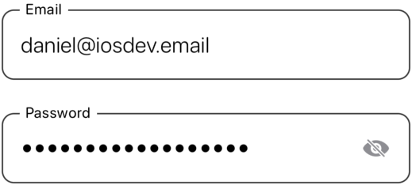

# SwiftUIBuddy

## Components

### Buttons
  
**StandardButton**

  
**DestructiveButton**

  
**PlusButton**

  
**DismissButton**

### Fields
  
**LoginField**

  
**DollarTextField**

## Description
SwiftUIBuddy is a collection of beautiful, easy-to-use components for your SwiftUI App. It contains custom Buttons, Pickers, Progress Views, Text Fields, and so much more! The components are highly customizable and built using 100% SwiftUI.

## Motivation
The library was designed with simplicity and functionality in mind. It strives to resemble Apple's design style and follow Human Interface Guidelines.

## How to Install
1) Go to Xcode -> File -> Add Packages
2) Paste https://github.com/Daniel-Berezhnoy/SwiftUIBuddy into the search bar
3) Confirm and install the Package
4) Import **SwiftUIBuddy** in the file(s) where you want to use it

## Notes
The minimum deployment target is iOS 15.0. This project is a work-in-progress, so expect it to grow, and feel free to contribute.
